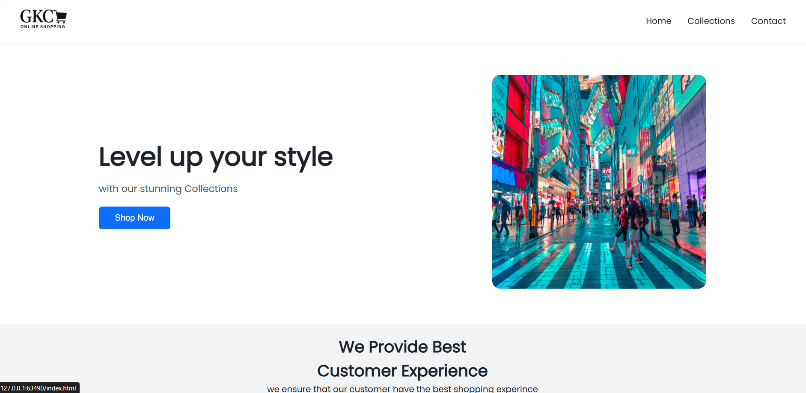
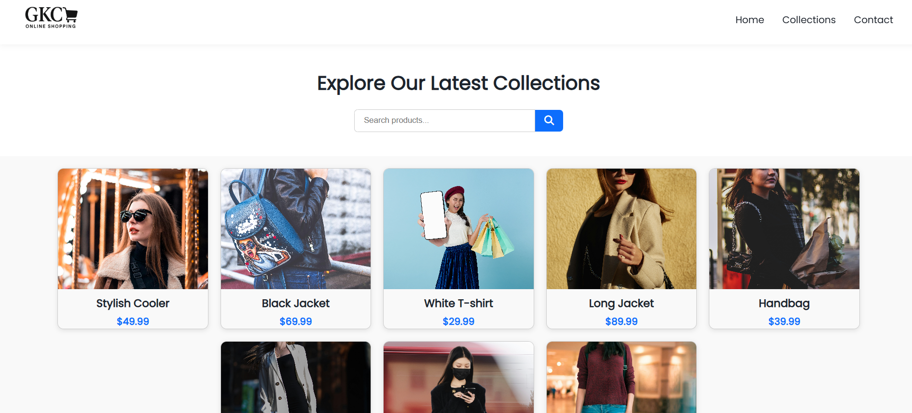
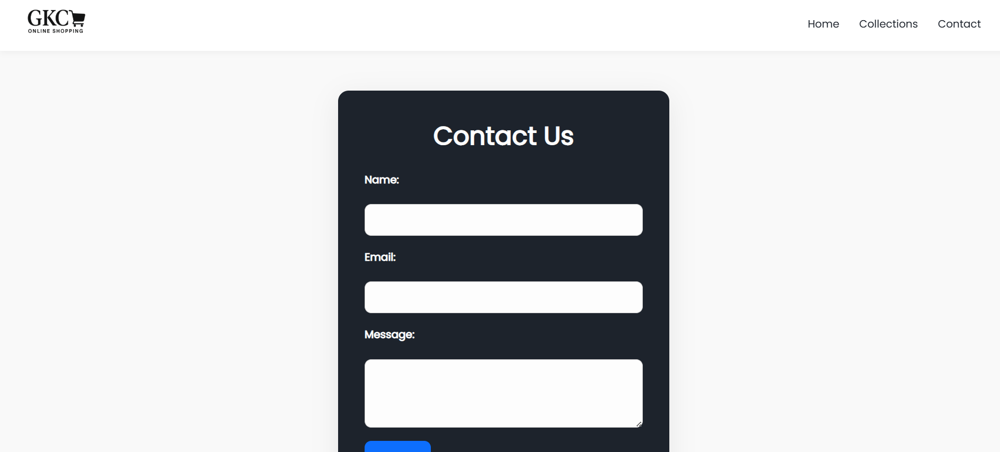

# 👗 GKC Online Shopping Website

Welcome to **GKC**, a sleek and modern fashion eCommerce landing page built with **HTML, CSS, and JavaScript**. This project features a fully responsive layout, clean design, and interactive UI elements, perfect for showcasing a brand’s latest collections and attracting online shoppers.

---

## 🔥 Features

- 🧭 Responsive Navbar with Side Menu (Hamburger Menu for Mobile)
- 🎯 Hero Section with Call to Action
- 💼 Featured Services Section
- 🆕 New Arrivals & Most Wanted Collections
- 📩 Newsletter Subscription Section
- 🦶 Beautiful Footer with Social Icons
- ✨ Font Awesome Icons Integration
- 📱 Mobile-First & Responsive Design
- 💅 Clean, modern UI using **Poppins** font

---

## 🛠️ Tech Stack

| Technology | Description |
|------------|-------------|
| **HTML5** | Page structure |
| **CSS3** | Styling and layout |
| **JavaScript** | Navbar toggle, basic interactivity |
| **Font Awesome** | Icons |
| **Google Fonts** | Typography (Poppins) |

---

## 📂 Folder Structure

/images -> Image assets (e.g., fashion.jpg, GKC_logo.png)
style.css -> Custom styles
index.html -> Main HTML file (Home Page)
collections.html -> Placeholder for product collections
contact.html -> Placeholder for contact form/page
index.js -> JS file for mobile navbar toggle
README.md -> Project overview

---

## 🚀 Getting Started

1. **Clone the repository**
 
git clone https://github.com/your-username/gkc-shopping.git
cd gkc-shopping

--- 

2.Open the website in a browser

You can open index.html directly in your browser.

💡 Tip: Use Live Server in VS Code for hot reload development.

📸 Screenshots
🖼️ Home Page

🛍️ Collection Page

📬 Contact Page

📬 Contact & Credits
Designed & Developed by Harishna K

Icons by Font Awesome

Fonts by Google Fonts

📃 License
This project is licensed under the MIT License. Feel free to use and modify for personal or commercial projects.

---

Let me know if you'd like to include deployment instructions (e.g., GitHub Pages) or want a `collections.html`/`contact.html` version too.
